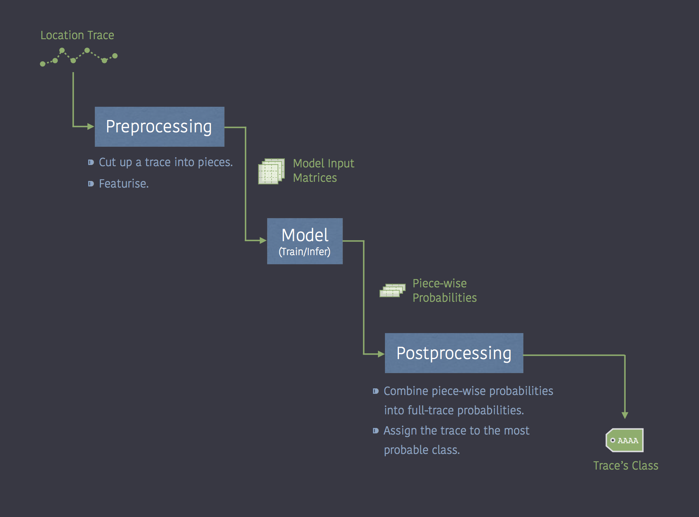

<h1 align='center'>trace-classifier</h1>


A library for building a classifier for location traces on [spark](https://spark.apache.org/) using [tensorflow](https://www.tensorflow.org/) and [tensorframes](https://github.com/databricks/tensorframes).

## TOC

<details>

1. [Overview](#overview)
2. [Install](#install)
3. [Develop](#develop)
4. [Environment](#environment)
    - [Training](#training)
    - [Inferencing](#inferencing)
    - [Notes on Running in Zeppelin Notebook](#notes-on-running-in-zeppelin-notebook)
5. [Overview](#overview)
6. [On Reading the Code](#on-reading-the-code)
    - [Preprocessing before Preprocessing](preprocessing-before-preprocessing)
    - [Label vs. Class](#label-vs-class)
    - [Analogies](#analogies)
        - [Features as 1D Signals](#features-as-1d-signals)
        - [Features as a 2D Signal](#features-as-a-2d-signal)
    - [Performance Optimization](#performance-optimization)
7. [Files Required for Training a Model](#files-required-for-training-a-model)
    - [Data](#data)
    - [Training Config File](#training-config-file)
        - [`PREPROCESS`](#preprocess)
        - [`INPUT`](#input)
        - [`TRAIN`](#train)
            - [`BATCH_GENERATOR`](#batch_generator)
            - [`FIT`](#fit)
            - [`EARLY_STOPPING`](#early_stopping)
            - [`MODEL_CHECKPOINT`](#model_checkpoint)
        - [`VALIDATE`](#validate)
        - [`SAVE`](#save)
8. [Files Produced by Training](#files-produced-by-training)
9. [Files Required for Inference](#files-required-for-inference)
    - [Data](#data-1)
    - [Model](#model)
10. [Customize](#customize)
    - [Custom Architecture](#custom-architecture)
    - [Custom Metrics](#custom-metrics)
    - [New Optimizer](#new-optimizer)
    - [Custom Loss Function](#custom-loss-function)
11. [Future](#future)
12. [References](#references)
13. [License](#license)
</details>


## Overview

trace-classifier is a skeleton for building a neural-network based classifier for location traces.

The high-level overview of trace-classifier looks like this:



What you need to provide:
  - The classes you want the model to learn.
  - How to cut up a trace.
  - Which features to use.
  - Training data.
  - A model architecture (optional).

trace-classifier provides the code for:
  - Cutting up and featurising a trace into model input (rectangular matrices of fixed size).
  - Performing *k*-fold cross validation and save the best model.
  - Freezing and optimizing for faster inference.
  - Using pretrained model to infer the class of unknown traces.

Best place to start is by reading [*On Reading the Code*](#on-reading-the-code) section and check out the example in [`sample_model/`](trace_classifier/sample_model/).

## Install
```
pip install git+https://github.com/mapbox/trace-classifier@v0.2.0
```

## Develop
```
python setup.py develop
```

## Environment

The code has been verified to work in the following environment:

- Python: `>3.5`
- PySpark: `2.3.1`
  - Recommend setting `spark.sql.codegen.wholeStage` to `False`
  - Recommend setting `spark.sql.caseSensitive` to `True`
- Tensorframes: `0.4.0-s_2.11` or `0.5.0-s_2.11`
- Tensorflow: Must match what tensforframes is using.
    - Tensorframes `0.4.0-s_2.11` uses tensorflow `1.6`
    - Tensorframes `0.5.0-s_2.11` uses tensorflow `1.10`
- Keras: `>2.2.1`


**Notes on running in Zeppelin notebook**: Zeppelin notebook's pyspark interpreter might fail to find tensorframes python library even when tensorframes has been added as a spark package.

<details>
<summary>What this error looks like</summary>

<br>

```
%spark

// Try importing tensorframes in spark shell (scala)
import org.tensorframes.{dsl => tf}
import org.tensorframes.dsl.Implicits._

//=> Success
```
But

```
%pyspark

# Try loading tensorframes in pyspark shell
import tensorframes as tfs
tfs.__version__

#=> ImportError: No module named 'tensorframes'
```

</details>

<details>
<summary>How to fix this error</summary>

<br>

This is because tensorframes' python binding is inside the jar file and `$PYTHONPATH` does not contain the path to tensorframes jar.

Do not `pip install tensorframes` as that installs an older version of tensorframes' python library that is not compatible with tensorframes 0.4.0-s_2.11 or 0.5.0-s_2.11.

First, find where tensorframes jar is located (usually in `~/.ivy2/jars/`):
```
%sh

# Find tensorframes jar

ls ~/.ivy2/jars/
# should see databricks_tensorframes-0.x.0-s_2.11.jar where x is 4 or 5
```

Next, check if this path is in $PYTHONPATH:
```
%sh

# Check if path to tensorframes jar is in PYTHONPATH
echo $PYTHONPATH
```

If not, add to `$PYTHONPATH`:

```
%pyspark

import sys, glob, os
sys.path.extend(glob.glob(os.path.join(os.path.expanduser("~"), ".ivy2/jars/*.jar")))
```

Try importing tensorframes again:
```
%pyspark


import tensorframes as tfs
tfs.__version__

#=> '2.0.0'
```

</details>

### Training

The process of turning location traces into model input matrix is distributed to slave nodes. Training of a model, however, is done on the driver node – i.e. all data is brought to the driver node. Current implementation assumes all the training data can fit in memory.

See [`sample_model/`](trace_classifier/sample_model/) for an example training script.

To start the tensorboard server and monitor the training progress, run
```
tensorboard --logdir <saved_logs_dir>
```
from the terminal. `<saved_logs_dir>` is the directory that contains tensorflow logs – see [*`SAVE`*](#save) section under [*Training Config File*](#training-config-file).


### Inferencing

Inference is distributed: pretrained tensorflow model is distributed to slave nodes by tensorframes.

See [`sample_model/`](trace_classifier/sample_model/) for an example inference script.


## On Reading the Code

### Preprocessing before Preprocessing

A location trace is a series of coordinates `[longitude, latitude, altitude, timestamp]`.

The preprocessing pipeline in trace-classifier requires that
- Timestamps are Unix time in ms,
- Traces be stored as `<array<array<double>>` in a pyspark DataFrame column.

If raw data does not satisfy the above, it need to be preprocessed prior to feeding to trace-classifier's preprocessing pipeline.

See the training script in [`sample_model/`](trace_classifier/sample_model/) for an example.


### Label vs. Class

For brevity, in this repo a ***class*** is defined as the string name of a group, and ***label*** is an integer representation of a class. Classes are usually stored as a list, where the position of a class in this list is its corresponding label.

For example (totally irrelevant to classifying traces), say that we have images of cats and dogs that need to be separated based on whether the image contains a cat or a dog:

```
classes = [ "cat", "dog" ]
              |      |
              |      |
              V      v
     label    0      1
```

### Analogies

Like the above example, documentations and variable names used in this repo make use of NLP and imagery analogies:

- `sentence` :: a full location trace
- `phrase` :: a piece of a traces
- `word` :: a group of coordinates which may or may not be consecutive
- `word vec` :: features derived from coordinates in word
- `word vec component` :: a feature (i.e. a characteristic) of a word, computed using the some or all coordinates in the word.
- `alphabet` :: a single `[longitude, latitude, altitude, timestamp]` coordinate

#### Features as 1D Signals

Each feature is treated independently by the model. Neurons in convolution layers only ever sees data coming from one signal.

For example (again, irrelevant to classifying traces), say if we have two features: temperature and brightness. A neuron in the first layer can take in the {`temperature at time t1`, `temperature at time t2`} as input, but it cannot take {`temperature at time t1`, `brightness at time t1`} as input.

This this analogous to a 1-pixel-wide image with multiple channels:
- `word vec size` :: Number of channels
- `phrase length` :: image height

The architecture provided in `architecture.py`, which is modified from [2], takes 1D features as input.

#### Features as a 2D Signal

This is analogous to a 1-channel image:
- `word vec size` :: image width
- `phrase length` :: image height

This repo does not contain an architecture for 2D features. See [*Customize*](#customize) section on how to add your own architecture.

### Performance Optimization

Sometimes a task is broken down into pieces.

Example 1: cheap-ruler measurement of distance.
- Cheap ruler is a copied from [[1]](#references).
- The scripts for computing the degree-to-kilometers multipliers is in `cheap_ruler` function in `cheap_ruler.py`.
- Calculation of distance is done in `create_word_vecs` function in [`word_vec.py`](trace_classifier/word_vec.py).

Example 2: normalization by mean-MAD.
- The scripts for computing the mean and the MAD are in [`scaler.py`](trace_classifier/scaler.py).
- Normalizing by subtracting the mean then dividing by MAD is done in `create_word_vecs` function in [`word_vec.py`](trace_classifier/word_vec.py).

This is to make life easier for Spark's optimizer.


## Files Required for Training a Model

### Data

Location traces.
Not provided in this repo.

### Training Config File

trace-classifier expects a training configuration json file or dictionary. See [`sample_model/`](trace_classifier/sample_model/`) for an example config json file.

The configuration file should contain 5 sections:

- `PREPROCESS`: parameters to be used in preprocessing
- `INPUT`: specification of model input
- `TRAIN`: parameters to be used in training a model
- `VALIDATE`: parameters to be used in validating a model
- `SAVE`: where to save files

Note that field names are case sensitive.

#### `PREPROCESS`

| Field | Description |
|:--|:--
| DESCRIPTION | (optional) For any remark.
| word_size | Tuple of integers `(N, B, S)`. <br>How to create a word.<br>`N` = number of coordinates in a word<br>`B` = stride between coordinates in a word (`B=1` for consecutive coordinates)<br>`S` = stride between words (`S=N` for no overlap between words)<br>See docstring for `create_words` function in [`word_vec.py`](trace_classifier/word_vec.py).
| desired_ops | List of tuples, or list of list of tuples. <br>Features of a word. See docstring for `create_word_vecs` function in [`word_vec.py`](trace_classifier/word_vec.py).
| normalize | One of {`False`, `'mean-mad'`}. <br>How to normalize word vec. See docstring for `create_word_vecs` function in [`word_vec.py`](trace_classifier/word_vec.py).
| clip_rng | (optional) Tuple of two integers. <br>The (min, max) range to clip each component in the word vec. See docstring for `create_word_vecs` function in [`word_vec.py`](trace_classifier/word_vec.py).
| ndigits | (optional) Integer. <br>Number of digits to round off the word vec components.
| desired_phrase_length | Integer. <br>Standard length of a phrase.

#### `INPUT`

| Field | Description
|:--|:--
| DESCRIPTION | (optional) For any remark.
| ndims | Integer. <br>Dimension of model input signal. See [*Features as 1D Signals*](#features-as-1d-signals) and [*Features as a 2D Signal*](#features-as-a-2d-signal) section.
| classes | List of strings. <br>Class names. See [*Label vs. Class*](#label-vs-class) section.


#### `TRAIN`

| Field | Description
|:--|:--
| DESCRIPTION | (optional) For any remark.
| loss | String. <br>Loss function. String name of a Keras built-in loss function, or a custom loss function. See [custom_objects.py](trace_classifier/custom_objects.py) for a list of custom loss function currently supported.
| metrics | String, or a list of strings. <br>Metrics to evaluate the model performance during training. Either the string name of a Keras built-in metric or a custom stateful metric object. See [custom_objects.py](trace_classifier/custom_objects.py) for a list of stateful custom metrics currently supported.
| optimizer | String. <br>String name of a Keras built-in optimizer; not all Keras built-in optimizers are supported – see [custom_objects.py](trace_classifier/custom_objects.py) for a list of supported optimizers.
| k_fold_cv | Integer. <br>Number of folds for *k*-fold cross validation.
| BATCH_GENERATOR | Dictionary. <br>Arguments for the batch generator. See [table below](#batch_generator).
| FIT | Dictionary. <br>Arguments for Keras' [`fit_generator`](https://keras.io/models/sequential/#fit_generator). See [table below](#fit).
| EARLY_STOPPING | Dictionay. <br>Arguments for Keras' [`EarlyStopping` object](https://keras.io/callbacks/#earlystopping). See [table below](#early_stopping).
| MODEL_CHECKPOINT | Dictionary. <br>Arguments for Keras' [`ModelCheckpoint` object](https://keras.io/callbacks/#modelcheckpoint). See [table below](#model_checkpoint).

##### `BATCH_GENERATOR`

| Field | Description
|:--|:--
| DESCRIPTION | (optional) For any remark.
| batch_size | Integer. <br>The batch size.
| shuffle | Boolean. <br>Whether to shuffle data.

##### `FIT`

| Field | Description
|:--|:--
| DESCRIPTION | (optional) For any remark.

Other fields supported are all the arguments of Keras' [`fit_generator`](https://keras.io/models/sequential/#fit_generator) except `epochs`, `validation_data`, `callbacks` and `workers`.

##### `EARLY_STOPPING`

| Field | Description
|:--|:--
| DESCRIPTION | (optional) For any remark.

Other fields supported are all the arguments of Keras' [`EarlyStopping` object](https://keras.io/callbacks/#earlystopping).


##### `MODEL_CHECKPOINT`

| Field | Description
|:--|:--
| DESCRIPTION | (optional) For any remark.

Other fields supported are all arguments of Keras' [`ModelCheckpoint` object](https://keras.io/callbacks/#modelcheckpoint) except `filepath`, `save_best_only`, `period` and `verbose`.


#### `VALIDATE`

| Field | Description
|:--|:--
| DESCRIPTION | (optional) For any remark.
| BATCH_GENERATOR | Dictionary. <br>Arguments for the batch generator. See [table above](#batch_generator).

#### `SAVE`

| Field | Description
|:--|:--
| DESCRIPTION | (optional) For any remark.
| saved_logs_dir | String. <br>Directory to save tensorflow logs.
| saved_model_dir | String. <br>Directory to save model and metadata.


## Files Produced by Training

The `train` function in [`train.py`](trace_classifier/train.py) saves the following during training:
- HDFS models (extension .h5), which includes metadata + weights + architecture + optimizer state from the epoch with best validation performance.
- Tensorflow logs.

For *k*-fold cross validation, train with `k_fold_CV` function in [`cross_validation.py`](trace_classifier/cross_validation.py). This produces *k* models and *k* corresponding tensorflow logs.

Use `save_model` function in [`save.py`](trace_classifier/save.py) to save freeze and optimize the HDFS model for fast inference. This will produce 2 files:
- A serialised model (extension .pb), which contains the weight + architecture.
- A metadata json file, which contains parameters required for preprocessing a trace.


## Files Required for Inference

### Data

Location trace.
Not provided in this repo.

### Model

A frozen tensorflow model (extension .pb) and its corresponding metadata json file.

Note: if not provided, this library loads the sample model in [`sample_model/`](trace_classifier/sample_model/).


## Customize

### Custom Architecture

You can feed your own model architecture to `train` function (see [`train.py`](trace_classifier/train.py)) and `k_fold_CV` function (see [cross_validation.py](trace_classifier/cross_validation.py)).

Model architecture should be wrapped inside a function that

- takes `n_classes` and `input_shape` as argument, and
- returns an *uncompiled* Keras model

Note: The input layer to the model must be named `input`, and the output layer must be named `output`; otherwise, freezing the model and inferencing will fail.

See [`architecture.py`](trace_classifier/architecture.py) for an example.


### Custom Metrics

You can use your own metric by adding to the `get_custom_metrics` function in [`custom_objects.py`](trace_classifier/custom_objects.py).

For an example of a custom stateful metric, see `F1` object in [`metrics.py`](trace_classifier/metrics.py).


### New Optimizer

You can expand the list of Keras optimizers supported by adding to the `get_optimizers` function in [`custom_objects.py`](trace_classifier/custom_objects.py).

Note: Currently there's no way to pass values to optimizer's argument. This requires API-breaking change to `construct_model` function in [`model.py`](trace_classifier/model.py) and therefore is left as a [to-do](#future).


### Custom Loss Function

You can use your own loss function by adding to the `get_custom_losses` function in [`custom_objects.py`](trace_classifier/custom_objects.py).

Note: Currently there's no way to pass values to a custom loss function. This requires API-breaking change to `construct_model` function in [`model.py`](trace_classifier/model.py) and therefore is left as a [to-do](#future).


## Future

Below is a list of minor changes that can make trace-classifier faster and more flexible:

- Remove all assumptions on column names.
- Select what to return from inference: probabilities and/or highest probability and/or just the class name that has the highest probability.
- Ability to pass arguments to the optimizer (see [*New Optimizer*](#new-optimizer) section)
- Ability to pass arguments to the custom loss function (see [*Custom Loss Function*](#custom-loss-function) section)
- Remove assumptions on the name for the model's input and output layer (see [*Custom Architecture*](#custom-architecture) section)
- Compute exact class weight in *k*-fold cross validation by using phrase count (see training notebook in [`sample_model/`](trace_classifier/sample_model/).
- Support more normalization methods (see docstring of `create_word_vecs` function in [`word_vec.py`](trace_classifier/word_vec.py))
- Add data aumentation to batch generator.


## References

[1] Agafonkin V. 2016. *Fast geodesic approximations with Cheap Ruler* ([link](https://www.mapbox.com/blog/cheap-ruler/)).

[2] Zhang Y, Wallace B. 2016. *A Sensitivity Analysis of (and Practitioners' Guide to) Convolutional Neural Networks for Sentence Classification* ([arXiv:1510.03820v4](https://arxiv.org/abs/1510.03820v4)).

[3] Definition of micro vs. macro vs. weighted metric: see [sklearn.metrics.f1_score](http://scikit-learn.org/stable/modules/generated/sklearn.metrics.f1_score.html#sklearn.metrics.f1_score)

[4] Sokolova M, Japkowicz N, Szpakowicz S. 2006. *Beyond Accuracy, F-score and ROC: a Family of Discriminant Measures for Performance Evaluation* ([link](https://www.aaai.org/Papers/Workshops/2006/WS-06-06/WS06-06-006.pdf)).

[5] Eesa A, Arabo W. 2017. *A Normalization Methods for Backpropagation: A Comparative Study* ([link](https://www.researchgate.net/profile/Adel_Eesa/publication/322146029_A_Normalization_Methods_for_Backpropagation_A_Comparative_Study/links/5a4a96a10f7e9ba868afeec4/A-Normalization-Methods-for-Backpropagation-A-Comparative-Study.pdf))


## License

Copyright (c) 2018 Mapbox.

Distributed under the MIT License (MIT).
